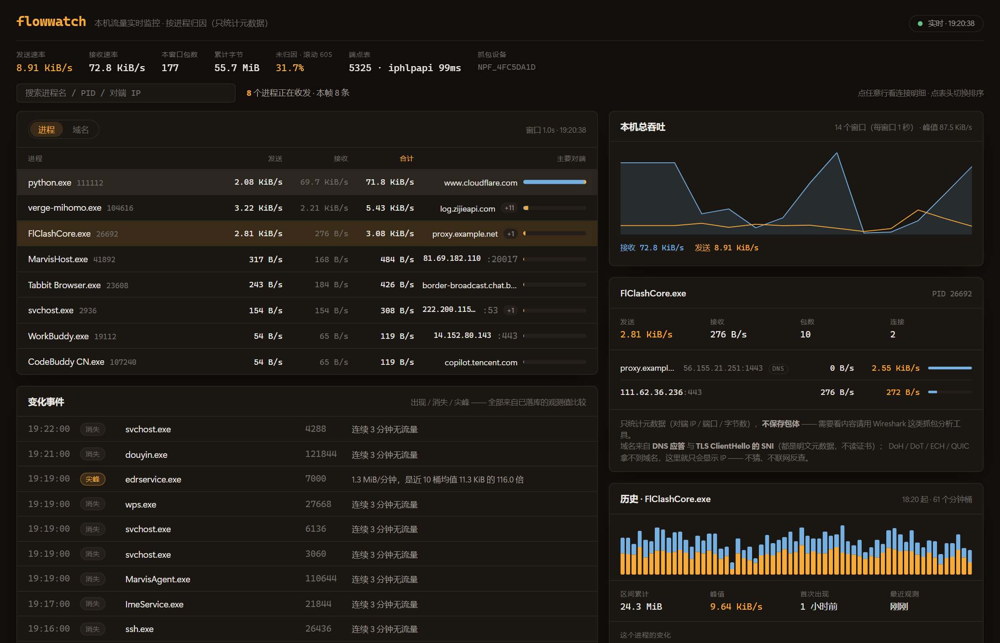
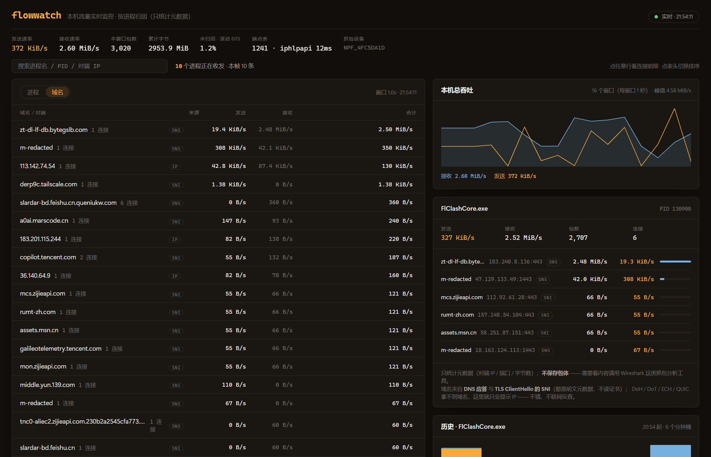

# flowwatch


> 回答一个任务管理器回答不了的问题：**这台机器上，哪个进程在跟谁通信、用了多少带宽、从什么时候开始的。**

`portwatch` 回答"谁占着端口"，`flowwatch` 回答"谁在偷偷用带宽"——同一套本地可观测性思路的两个切面。

## 与现有工具的关系（定位）

| 工具 | 它回答的问题 | 本项目的位置 |
|---|---|---|
| Wireshark / tshark / Fiddler / Charles / mitmproxy | **这个包里是什么**（深度解析、改写、重放） | **不竞争**：只统计元数据，不落包体 |
| ntopng / Zeek / NetFlow / PRTG / SolarWinds | **整网 / 设备级**流量态势（主机、协议、地理、SNMP） | 那是网络视角；本项目是**本机进程视角** |
| 任务管理器 / 资源监视器 | 本机进程级速率，但**只有此刻的一个数字** | 补上**连接归因 + 历史留档 + 查询** |
| GlassWire / NetLimiter（商业闭源） | 本机进程级 + 历史 | **开源侧的空档** |

## 技术路线（已实测验证，不是纸上设计）

- **必须抓包**：Windows 上没有可用的"每连接字节数"API ——
  `GetPerTcpConnectionEStats` 读回 `NOT_SUPPORTED`（回环与非回环都试过，且 `Set` 开启采集返回成功，说明不是权限问题）；
  `psutil` 只有接口级 `net_io_counters` 与连接表（**没有字节数**）。
- **抓包走系统已装的 Npcap**（`wpcap.dll` + `Packet.dll`），用 `ctypes` 直接调用：
  **不需要额外 Python 包，也不需要管理员**（除非 Npcap 安装时勾了"仅管理员可抓包"）。
- **归因靠连接表**：包里只有 `IP:port`，用 `psutil.net_connections()` 建 `(ip, port) → pid` 映射，
  把字节数算到进程头上；通配地址（`0.0.0.0` / `::`）的条目额外进"按端口回退表"，否则 UDP 几乎全丢。
- **端点表必须周期重建**：连接不断新建/关闭，只取一次快照时**未归因率 82%**（实测）；
  改成周期重建 + 端口回退 + IPv6 解析后，好窗口能到 1% 量级，但**中位数仍有 30%** ——
  这个缺口是什么、怎么量的、卡在哪，见下文《归因质量》一节（那里没有一个数字是估的）。

## 快速开始

```bash
pip install -r requirements.txt

# ① 只看数据（不需要前端）
python collector.py --list-devices     # 列出 Npcap 设备
python collector.py --seconds 10       # 前台打印 Top-N 进程速率
python collector.py --dev WLAN --top 12

# ② 完整仪表盘：API → http://127.0.0.1:8788，前端 → http://127.0.0.1:5273
python server.py
cd web && npm install && npm run dev
```



> 进程视图：左=进程排行（琥珀为发送、蓝色为接收，条形长度=相对流量，点任意行看明细）；
> 右上=本机总吞吐曲线（每窗口 1 秒）；右中=选中进程的连接明细（域名 + IP:端口 + 方向速率）；
> 右下=该进程的历史（分钟桶柱状图 + 区间累计 / 峰值 / 首次出现）。



> 域名视图（左上「域名」页签）：本窗口内按**全部连接**汇总的域名排行，来源标注 `SNI` / `DNS` /
> `IP`（未拿到域名）；页脚给出近 1 小时的 Top 榜。截图取自本机真实运行（本机 IP 与个人代理域名已脱敏）。

真实输出（本机运行中，代理客户端在跑）：

```
device=\Device\NPF_{4FC5DA1D-...}  端点表 6299 个（刷新 203 ms）
    PID  进程                          发送速率        接收速率   包数  主要对端
  26692  FlClashCore.exe              2.4 MiB/s     46.8 KiB/s  12790  18.163.126.61:1443
 121308  Marvis.exe                   4.7 KiB/s      171.7 B/s    244  224.0.0.251:5353
  27836  mCloud.exe                 1019.3 B/s      212.7 B/s     20  36.140.64.106:443
   2936  svchost.exe                  22.6 B/s       96.4 B/s     10  222.200.115.252:53
```

## 设计决定：隐私边界

只统计**元数据**（IP / 端口 / 字节数 / 包数），**不保存包体**；snaplen 限 2048 字节、抓包线程只解析头部。
这条边界写在设计里，也写在文档里——它同时也是"不越权"的技术约束。

**接了流量助手（见《流量助手》）之后这条边界怎么延续**：助手默认只把**聚合元数据**
（进程名 / 域名 / 字节数）发出去；对端 IP:端口这类明细**只在你明确问"连了谁 / 哪个 IP /
端口明细"时才进入上下文**，而且实现方式是"明细工具在聚合档下压根不注入给模型"——
物理隔离，不是提示词承诺。用本地 Ollama 或 mock 模式则零外发。

## 已知成本（实测）与待优化

| 项 | 实测 | 计划 |
|---|---|---|
| 端点表重建 | **57–61 ms/次**（直接调 IP Helper API 的 4 张表 + IP 文本缓存）；同条件 `psutil.net_connections(kind="inet")` 是 **97–102 ms** → **1.7×**，按 1.5s 刷新约占单核 4% | 可再降到 ~2s 刷新周期；或只重建变化部分 |
| 回环流量 | 不在同一设备上 | 已支持额外抓 Npcap 的 loopback 设备（`--no-loopback` 可关） |
| 抓包依赖 | 需装 Npcap（管理员 + 驱动） | README 如实标注，与 portwatch"需管理员才能拿完整归因"同类摩擦 |

### 一次被自己推翻的优化（值得记住）

第一版从 `psutil` 换到直接调 `GetExtendedTcpTable` 后，刷新成本**反而从 ~100 ms 涨到 118–150 ms**。
原因不是 API 慢，而是我在**每一行**都调了 `ipaddress.ip_address().compressed` 做规范化（8000+ 次对象创建）。
去掉它、改成 `inet_ntoa` / `inet_ntop` 直接产出 + 文本缓存后降到 **57–61 ms**。

教训两条：
1. **"换成更底层的 API"不等于更快** —— 必须实测对照；
2. **对照口径要对齐** —— 最初的基准只测了 TCP v4 单表（35 ms），而真实实现要查 4 张表（v4/v6 × TCP/UDP），
   拿单表去比全量会得出"3× 提速"的错误预期。

## 归因质量：未归因率是怎么量的、又卡在哪

"字节数"和"归因"是两个独立环节：字节数来自抓包（准确），归因来自连接表（**有结构上限**）。
所以本项目把"说不清是谁的"单独记账，而不是混进总数里假装准确。

| 分类 | 含义 | 处置 |
|---|---|---|
| 已归因 | 端点表命中 PID | 算到进程头上 |
| 未归因 | 是本机流量，但查不到 PID | 计入 `unknown_ratio`；CLI `--diag` / 帧里带明细（前 8 条流） |
| 属主受限 | 端点已知，但非提权调用拿不到 owning PID | 哨兵 PID `-1`，UI 显示"（属主受限·需管理员）"，**不冒充任何进程** |
| 别人的流量 | 两端都不是本机地址（广播域里的邻居帧） | 不计入本机统计（`foreign_packets`） |
| 非 TCP/UDP | ARP / ICMP / 头部不全 | 不参与统计（`skipped_packets`） |

### 三段实测，每段都有对照

1. **混杂模式会顺手偷别人的流量**。第一版 `pcap_open_live(..., promisc=1)`，抓到了
   `10.x.x.x:137 → 10.x.255.255:137`、`10.x.x.x:52010 → 10.x.255.255:5684` 这类（网段已脱敏）
   同网段邻居的 NetBIOS/多播广播 —— 它们既不该算本机流量，也不该算本机"归因失败"。
   改成 `promisc=0` + **本机地址白名单**（接口地址集合，随端点表一起刷新，VPN 重连也能跟上）。
2. **"未归因"不是一件事，是三件事**。给 `pid_of` 插桩（`scripts/diag_miss.py`）才看清：
   未命中的主体是"**表里完全没有这个端口**"；再用 100 ms 高频轮询判别（`scripts/diag_race.py`）后得到
   硬结论 —— **20.5% 的未归因字节属"短命 socket 漏拍"，79.5% 属"表里从未出现过"**。
3. **"System Idle Process 在用带宽"是假象**。非提权调用时有 **899/5394 条**端点的 owning PID
   返回 0，第一版把它们记到了 PID 0 账上（UI 上就出现"System Idle Process 在发数据"）。
   现在记成哨兵 `-1`，如实归入"属主受限"。

对应的工程手段（都小而可见）：本机地址白名单、`promisc=0`、**端点短时记忆**（TTL 6s，救刚消失的条目）、
**四元组记忆**（TTL 30s，双向共用一键：一个方向归因成功，反方向即可继承）、
**自适应刷新**（未归因 >25% → 0.4s，>8% → 0.8s，否则 1.5s）。

### 结果，以及剩下的 30% 是什么

| | 均值 | 中位 | 最小 | 最大 |
|---|---|---|---|---|
| 改动前 | 36.8% | 35.0% | 10.3% | 78.9% |
| 改动后 | 29.8% | 33.2% | **1.1%** | 79.1% |

### 指标口径：单窗口不够用，要滚动

单窗口未归因率在**空闲窗口会剧烈波动**（同一台机器实测 1% ~ 99%）：分母太小的时候，
一条查不到 PID 的连接就能占满整窗。所以对外有两个口径，都如实给出：

- `unknown_ratio`：**本窗口**比率（实时、敏感，但噪声大）；
- `unknown_ratio_rolling` + `rolling_windows`：**近 N 个窗口的合计比率**（默认 60 窗 ≈ 1 分钟），
  同时给出样本窗口数，便于判断这个数字可不可信。

界面上头部显示滚动值（`未归因 · 滚动 60s 20.0%`），页脚同时给出本窗口值 —— 只报一个数字好看，
但那不是诚实的做法。

剩下的缺口是**结构性**的，调参补不了：生存期几十毫秒的 socket（本机实测是代理客户端的出站连接，
一个请求一条连接）在 60 ms/次的表读面前必然漏掉 —— 把轮询提到 165 ms 也抓不到（`scripts/diag_race.py`）。
根治只能换事件源：**ETW `Microsoft-Windows-Kernel-Network`**（连接建立时内核就带 PID 报事件）——
已在 2026-09-17 打通，**根因、修法与证据**见《ETW 归因》一节（那一节里有我踩过的最贵的一个坑）。

> ⚠️ **上面那 30% 不是稳定值**：它由**流量构成**主导 —— 同一台机器、同一份代码，
> 空闲时段只有 4.5%，短连接密集时能到 29.8%（三个对照点见《ETW 归因》的净收益表）。
> 引用时请当成"某类时段的典型值"，不要当常数。

> 在那之前，这个数字**宁可如实标出来**，也不靠改口径把它藏进分母里。

## ETW 归因：那 30% 的缺口，以及被我先否掉的两条路

剩余未归因是**结构性**的：生存期几十毫秒的 socket 在连接表快照面前必然漏掉。动手前先否掉两条路：

1. **把表读得更快**：实测把逐行 `struct.unpack` 换成 `array` 批量解析只有 **1.6×**
   （58.4 ms → 35.8 ms / 5300 行），瓶颈在 iphlpapi 本身的 4 次表收集调用；照这个数，
   10 Hz 轮询要吃掉单核 **36%**、20 Hz 是 72% —— **不值得**（`scripts/bench_table.py`）。
2. **端口级推断**（"这个端口大概归谁"）：只有单侧信息，CDN 与端口复用场景会混淆归属 —— 不做。

于是只剩换事件源：**ETW `Microsoft-Windows-Kernel-Network`**，内核在**连接建立那一刻**就带 PID 报事件。

### 事件 ID 与字段：查官方清单，不靠记忆

我记忆里的 connect 是 `10/11` —— **错的**。读官方清单（`etw-providers-docs` 的
`Microsoft-Windows-Kernel-Network.xml`）后确认：

| 事件 | IPv4 | IPv6 | 载荷（按声明顺序） |
|---|---|---|---|
| 连接建立 Connectionattempted | **12** | **28** | PID(4) size(4) **daddr** saddr dport(2) sport(2) mss sackopt … |
| 连接接受 Connectionaccepted | **15** | **31** | 同上（复用 connect 模板） |
| 连接断开 Disconnectissued | **13** | **29** | PID(4) size(4) daddr saddr dport(2) sport(2) seqnum connid |

IPv4 地址 4 字节、IPv6 16 字节，关键字 IPv4=0x10 / IPv6=0x20。
**send/recv（10/11/26/27）刻意不解析** —— 数据量太大，而"这条连接属于谁"在建立那一刻就已确定。

### 三条纪律（都是"不许误归因"的产物）

1. **结构体不手算偏移，且尺寸与关键偏移都要断言**：全部按文档字段顺序用 ctypes 定义，让平台 ABI
   决定 padding；导入时断言 `WNODE_HEADER 48` / `EVENT_TRACE_PROPERTIES 120` / `EVENT_TRACE 88` /
   `EVENT_TRACE_LOGFILEW 448` / **`EventRecordCallback` 偏移 424** / `EVENT_HEADER 80` /
   `EVENT_RECORD 112`；断言不过就**根本不启用** ETW。
   > **基准必须来自独立参照物**（成熟库 / 官方头文件），不能来自我自己的推算。
   > 我第一版只断言 sizeof，还把一个**错的偏移（432）**当成“与手推一致”的交叉验证写进了文档 ——
   > 结果就是下面那次“自检全绿、却零回调”的连环撞墙。
2. **fail-closed**：每条事件先过 sanity —— 本机侧地址必须**真属于本机**。若我把 `daddr`/`saddr`
   理解反了、或 IPv6 按 4 字节读了，这里必然失败，连续 5 次就停用 ETW 并写明原因，
   而不是把字节算到错误的进程头上。
3. **拿不到权限就降级**：创建 ETW 会话需要管理员（或 Performance Log Users 组）。非提权运行时
   `state="denied"`（实测 Win32 `error_code=5`），主链路照常；`health.etw` 与界面页脚
   都会显示"ETW 归因 未启用（需管理员）"。

> 拿到的是 5（拒绝访问）而不是 87/234（参数/长度错误），反过来说明 `EVENT_TRACE_PROPERTIES`
> 缓冲区结构是健康的（Windows 先校验参数、后判权限）—— 这是非提权环境下能得到的间接证据。

### 验证状态：**实时消费已打通**（2026-09-17 结案；根因不在会话、权限或环境）

提权跑了 6 轮判别实验，逐层把责任面缩小到"我这一侧的消费端"：

| # | 实验 | 结果 |
|---|---|---|
| 1 | 提权 A/B（`--no-etw` vs 默认） | `StartTraceW = 0` ✓（提权与 `EVENT_TRACE_PROPERTIES` 都通过）；`EnableTraceEx = 87` ✗ |
| 2 | 启用方式判别 | `EnableTraceEx2` = 0 ✓；**旧的 `EnableTraceEx` 对内核与用户态 provider 都返回 87** ✗ → 已改为 `EnableTraceEx2` |
| 3 | 事件数为 0 的原因 | **用户态 provider 对照也是 0 条** ✗ → 不是内核 provider 的特殊要求 |
| 4 | (mode 偏移 × 回调偏移) 网格 | 21 组组合**全部 0 次回调** ✗ → 也不是回调偏移 |
| 5 | **绕过本层、用系统 `logman` 采同一 provider** | 9 秒采到 **73,981 条** Kernel-Network 事件（`tracerpt` 转 CSV 验证）✓✓ |
| 6 | 挂到 `logman` 建的实时会话 | 仍 **0 次回调** ✗（自检显示交给 ETW 的字节正确：mode `0x10000100`、回调指针已写、句柄有效） |
| 7 | **与成熟库 pywintrace 0.2.0 逐项对照结构体尺寸/偏移** | **一次撞出根因**（见下）✓✓ |

#### 根因：嵌套结构体多 8 字节，回调指针落在 Windows 不读的位置

现代 SDK 的 `EVENT_TRACE_HEADER` **没有** `KernelTime`/`UserTime`（XP 时代 MOF 版本才有），
我照旧文档多写了一个 8 字节字段，于是：

```
EVENT_TRACE_HEADER  我 56 字节   /  参照物 48   →  EVENT_TRACE 我 96 / 应 88
  → EVENT_TRACE_LOGFILEW 里 CurrentEvent 之后的字段**整体后移 8 字节**
  → 回调指针写到偏移 432，而 Windows 在 424 处取它（视为 NULL）
  → ProcessTrace 静默零回调：既没有错误码，也没有事件
```

第二处错同时修掉：`Wnode.Flags` 我写成 `0x2`（那是 `WNODE_FLAG_INSTANCE`），
正确的 `WNODE_FLAG_TRACED_GUID = 0x20000`。

**为什么连撞 6 次墙**：我自检里能看的那两个偏移（`LoggerName`=8、`ProcessTraceMode`=28）
**都在 `CurrentEvent` 之前** —— 于是"会话建得起来、句柄有效、自检全绿"三件事同时成立，
唯独没有一处检查回调指针的落点；我甚至把一个**错的 432** 当成"与手推一致"的验证写进了文档。

**修完后的提权实测**（`scripts/etw_realtime_check.py`，同一进程内跑两条实现 + 受控延迟）：

```
【0】布局对照（基准 pywintrace 0.2.0）：EVENT_TRACE_HEADER 48/48 · EVENT_TRACE 88/88 ·
     EVENT_TRACE_LOGFILE 448/448 · EventRecordCallback 偏移 424/424            → 全部一致
【1】pywintrace 基线 10s：85 条事件 {12:13, 13:63, 15:9}                        → 环境/provider/权限正常
【2】flowwatch 实现 10s：state=running events=60 learned=17 forgotten=43 sanity_failures=0
     10.x.x.x:51953 -> 61.151.230.245:47873  归因 PID=23968                  → 真正收到并归因
```

`sanity_failures=0` 值得单独说：那条校验要求"本机侧地址必须真属于本机"，它零失败意味着
**载荷字段顺序（`daddr` 在前、`saddr` 在后）与地址宽度也都是对的** ——
fail-closed 的判据在这里正好变成正面证据。

- ✅ **解析层**：`tests/test_etw.py` 覆盖 IPv4/IPv6、connect/accept/disconnect、截断载荷、PID/端口非法值，
  以及"`daddr`/`saddr` 反了能否被 sanity 抓住" —— 全绿（尺寸/偏移断言改动后复测仍全绿）
- ✅ **布局**：尺寸 + **关键偏移**断言，基准值取自 pywintrace 的实际布局（不再用我自己的推算）
- ✅ **启用方式**：按实验结果用 `EnableTraceEx2`（代码注释里写明了 87 的来源）
- ✅ **降级路径**：非提权 `state="denied"`（Win32 `error_code=5`），主链路不受影响
- ✅ **实时消费**：已打通（证据见上），`scripts/etw_realtime_check.py` 可随时复跑
- ⚠️ **净收益测量（2026-09-17，`scripts/etw_benefit_measure.py`）—— 结论：测不出净收益，别当它已证明有用**

  提权下做了四轮对照（唯一变量是 ETW，两阶段都跑同一份受控短连接负载），**前三轮结果互相矛盾**，
  第四轮换成"按来源分账"这个与负载量无关的指标才把话说清楚：

  | 轮次 | 指标 | 不开 ETW | 开 ETW | 结果 |
  |---|---|---|---|---|
  | 1 | 受控负载被归因字节 | 53.5 KiB | 178.7 KiB（3.3×） | 一度以为成了 —— **极可能假阳性** |
  | 2 | 同上（+UDP，但 tracker 自停） | 823.2 KiB | 1278.2 KiB（1.55×） | 与第 1 轮差 50 倍 |
  | 3 | 同上（三阶段：基线/+TCP/+UDP） | 424.9 KiB | 349.8 / 318.6 KiB | 方向反了 |
  | 4 | **按"键的出处"分账**（与负载量无关） | `etw` 来源 0.0 KiB | **`etw` 来源 0.0 KiB** | **ETW 学到的键一条都没被用上** |

  **前三轮的指标为什么不能用**：它的分母随流量自然波动 ±2×（不同域名、不同响应体、CDN 变化），
  把要测的效应完全淹没 —— 第 1 轮那个 3.3× 就是这么来的。第四轮的指标才是能回答问题的：
  `ConnMemory` 里的键有两个来源（端点表学到的 / ETW 学到的），**只有 ETW 能学到"表从未见过的四元组"**，
  所以"`etw` 来源的键救回了多少字节"就是它的净贡献，分母不参与。
  实测 **0.0 KiB**（同时 `table` 来源有命中 ✓ —— 说明分账管道本身是通的，不是统计没接上）。

  **所以现在的诚实结论是**：
  - ✅ ETW 实时路线**确实在工作**：会话建立、事件持续到达、映射持续学习（实测 297 条 TCP / 22,616 条 UDP）、
    `sanity_failures=0`、fail-closed 保证不误归因；
  - ❌ 但这些映射**一次都没被归因路径命中**，整机未归因率与负载归因字节都没有稳定差异 →
    **当前版本不能声称 ETW 带来净收益**（README 早期那版写的 3.3× 已按实测撤回）。
  - **两个候选原因已判定（未命中近邻诊断）**：未命中时去记忆里找"同一个本地端口"的记录并统计
    差异字段（`ConnMemory._probe_near_locked`，只探前 400 次未命中以封顶开销）。实测：
    **2,944 次未命中，探到的 400 次里没有任何一条同端口候选**（`near_by_source` 为空）——
    ② **键的归一化对不上被排除**（若只是地址文本形式不同，必然会找到同端口候选）；
    而且**连 UDP 事件开着时（`learned=12114`，其中 UDP 11,745）也一样**。
    → 结论是：**记忆里根本没有那批未归因流的任何记录**，ETW 的事件覆盖范围与"残余缺口"不是同一批流。
  - 因此 ETW 当前的定位应该是：**机制已验证可用、净收益未证实**。留着它的价值在"可验证的负结果 +
    方法学"（四轮对照、按来源分账、近邻诊断都是可复用的工程手法），而不是"它补上了缺口"。
  - 残余缺口的**组成（2026-09-17 实测，`scripts/forwarding_hypothesis_probe.py`）**：按字节
    **98% 是 TCP**（TCP 834.4 KiB vs UDP 4.2 KiB）→ 我先前猜的"QUIC/UDP 占多数"被实测否掉，
    所以 `--etw-udp` 不值得再投入（它继续以 opt-in 存在，默认关）。
  - 关于"这些 TCP 流为什么归不了"：我试过用"本地端口是否出现在 socket 表里"来验证
    "本机转发流量（虚拟机 / WSL / 容器 / NAT，宿主上没有 socket）"这个假设 —— 但**该探针自带的对照组
    否决了它自己**：已归因连接的远端命中率同样只有 39~44%（连接本身很短命，事后再查表必然查不到），
    说明检测方法不可靠 → **该结论不成立**，如实标注、不当证据用。
  - **"这台机器在当 NAT 网关"这条假设已被证伪**（2026-09-17 提权实测，`scripts/ics_probe.py`）：

    | 检查 | 结果 |
    |---|---|
    | 开启 IP 转发的接口 | **0 个** |
    | WinNAT 实例 | 无 |
    | 未归因流端口 vs WinNAT 会话端口 | 93 个 vs 3 个，**重合 0** |
    | ICS 注册表 | `ScopeAddress=192.168.137.1` —— 只是**曾经**配过 ICS，当前没转发 |
    | 服务 | `SharedAccess`/`hns` Running，但 `winnat`/`vmcompute` Stopped |

    也就是说：那"三条同时吻合"只是**巧合式解释**，一测就破 —— 这正是"先假设、后验证"的价值，
    而不是把自洽的猜测当结论写进文档。
  - **残余缺口已定位到：生命周期极短的连接**（单流深挖，`scripts/single_flow_probe.py`）。
    做法与上一次不同：这次给未归因流加了 **TCP 标志位指纹**（`S` 握手 / `A` 确认 / `P` 数据 /
    `R` 复位 / `F` 结束，随 `unknown_flows[].signs` 输出），并且**在流还活动时就连查 3 次表**
    （跨 1.5 秒）—— 上一版失败的根因就是"40 秒后查表"，那必然查不到短命连接。

    | 标志位指纹 | 形态 | 字节 | 即时查表命中（精确/同端口/同远端） |
    |---|---|---|---|
    | `APS` | 握手 → 数据 → 结束 | 7~15 KiB | **0/3 · 0/3 · 0/3** |
    | `AFS` | 完整生命周期 | 0.7 KiB | **0/3 · 0/3 · 0/3** |
    | `AS` | 仅 SYN-ACK（握手即终止，多为 `:853` DoT） | 0.2~0.4 KiB | **0/3 · 0/3 · 0/3** |
    | `udp` | 偶发 QUIC（`183.60.168.25:443 → …`） | 91 KiB | **0/3 · 0/3 · 0/3** |

    结论：即使即时查表也查不到 → 它们**在查表那一刻就已经关闭了**。
    其中 `AS` 那一类（握手即终止，很可能是被重置）**本就没有可归因的 socket**，不算缺陷。
    （顺带再提醒一次口径：这次冒出一条 91 KiB 的 UDP 流，所以"98% 是 TCP"只是**某个时段**的值。）

  - **由此落定一个待验证假设**：**ETW 的事件投递延迟 > 这些连接的生命周期** ——
    事件到达时，那些包早就被计入未归因了，所以才会出现"ETW 学到了映射、却一次都没命中"。
    验证手段已备好：`scripts/etw_realtime_check.py` 第三步的**受控 loopback 归因延迟**（需管理员运行）。
    若成立，ETW 的诚实定位就是：**对"存活足够久"的连接有效，对几十毫秒的连接无效** ——
    而不是"它补上了那 30%"。

  **UDP 那一档（`--etw-udp`，opt-in）**：UDP 事件（42/43/58/59，ID 来自 `wevtutil gp` 清单；
  模板与连接事件同构，经官方清单 `repnz/etw-providers-docs` 核实）确实能收到
  （实测 40 秒 11.6 万条 ≈ 2900/s、学到 2.2 万条映射），但**内容大多不可用** ——
  9.35 万条事件的地址两侧都不属于本机（归一化 IPv4-mapped IPv6 之后仍然如此），
  所以它保持 opt-in，且与 TCP 一样**没有可观测的净收益**。唯一的好消息：
  这次 fail-closed 没有再自伤（`state=running`、`sanity_failures=0`），
  "两侧都不是本机就跳过、不学"的设计生效了。

  **方法学坑（不记下来就会重犯）**：
  1. **整机未归因率由流量构成主导**：同一台机器同一份代码，空闲时段均值 4.5%、短连接密集时 29.8%
     —— 不受控地比"开 ETW 前后"，测到的只是"两个时段流量不一样"。
  2. **`/api/rates?limit=N` 只能把已按 `TOP_N`（50）截断的进程表再截短** → 低速率进程测不到
     （第一版指标恒为 0，差点被误读成"ETW 无效"）→ 改用历史层按 pid 取累计字节。
  3. **环境变量传不进提权进程**（UAC 给子进程全新环境块）→ 受控负载改成默认开启。
  4. **指标必须对"被测对象的自然波动"免疫**：分母随负载缩放，效应就消失在噪声里 ——
     这是前三轮白做的根本原因。**先问"这个指标的分母稳不稳"，再动手测。**

  另有一条工程发现（已修）：**ETW 会话会在创建者被强杀后残留** —— `terminate()` 不给 `stop()` 机会，
  而会话在进程死后依然存在 → 下次启动撞 `StartTraceW = 183`（`ERROR_ALREADY_EXISTS`），
  表现是"实时路线静默失效"（整个阶段 events=0）。撞 183 现在会**先停掉遗留会话再重建**（自愈）。
  注意：**非提权的 `logman query -ets` 看不到提权进程建的会话**（实测）——"查不到"不等于没残留。

  另外从"未归因流"里看清一件事：剩下的缺口里 **UDP（DNS 响应）占相当比例**
  （`*.53 → 本地随机端口`，每个 0.1 KiB），而 connect/accept 事件**只覆盖 TCP** ——
  UDP 那部分要靠别的事件类型，不在本层范围内（如实标出，不假装已解决）。

### 批量路线：已实现，但它救不了短命 socket（把结论写清楚，免得自欺）

既然 `logman` 已证明可用，就把它实现成第二条路（`etw_batch.py`，开关 `--etw-batch`）：
`logman` 采 ETL（默认 3 秒窗口）→ `tracerpt` 转 XML → 解析 connect/accept/disconnect → 喂四元组记忆。
实测数据（本机 9 秒、有真实流量）：ETL 8.1 MB → XML 105.9 MB、`tracerpt` 2.05 秒；
但 **XML 解析只要 0.28 秒（377 MB/s）**，且只关心 **0.58%** 的连接事件，字段齐全
（`PID=112368 · daddr · saddr · dport · sport`，顺带印证了按官方清单写的字段顺序）。

**然而它救不了短命 socket**：3 秒窗口 + 转换 ≈ 3–6 秒延迟，而短命 socket 的包在几十毫秒内就飞完了 ——
等学到 PID，那些包早已计入未归因。所以它的定位是**取证/补充**（回答"某个时点这个 IP:端口 属于谁"），
不是那 30% 的解法。

**两条路线现在的分工**：实时（`--etw`，需管理员）是**唯一能补短命 socket 的路**；
批量（`--etw-batch`）是取证/补充。两者默认都关闭 —— 默认值按证据定：
实时路线需要权限，而"该不该常开"应由 `scripts/etw_benefit_measure.py` 测出的差值决定，不由手感决定。

## 域名解析：把 IP 变回人看得懂的名字

只读两种**明文元数据**，不联网、不反查、不读证书：

| 来源 | 给出什么 | 局限（如实标注） |
|---|---|---|
| **DNS 应答**（抓到 UDP/TCP 53、mDNS 5353 的响应，解析 A/AAAA 记录） | `名字 → IP` | 一个 IP 上可能挂很多站点（CDN），只能说"这个 IP 可能是谁" |
| **TLS ClientHello 的 SNI**（出站首包里的 server_name 扩展） | `IP:端口 → 域名` | "这条连接要去哪"，最准；ECH 加密后拿不到 |

优先级 **SNI > DNS**；界面上每条连接标来源（`SNI` / `DNS`），拿不到就显示 IP —— 不猜、不用第三方库反查。

拿不到的都承认：**DoH / DoT**（DNS 被加密）、**ECH**（SNI 被加密）、**QUIC**（UDP 443 的 Initial 需要按密钥派生才能解，本层不碰）。
所以"域名覆盖率"是个**随运行时间上升**的指标，不是 100%。

> **冷启动现象（实测）**：解析是观测式的 —— 已经在跑的连接，它们的 DNS 查询与握手早在采集开始之前就发生过了，
> 不会回溯补名。仓库里带了 `tools/traffic.py`（真连真实站点、跑系统 DNS + 真实 TLS），用来演示与验证这条链路。

实测（本机常驻进程 + 90 秒演示流量）：DNS 记录 588 条 / SNI 73 条，已知 IP 123 个 / 端点 32 个，命中 201/942。

> 顺带一个只有元数据视角才能看清的现象：**同一个 CDN IP 会同时挂着好几个域名**，
> 光看 IP 分不清是哪家在通信 —— 这正是 SNI 比 DNS 更准的原因，也是"域名覆盖率"要分开报两个来源的理由。

### 域名维度的历史：哪个域名用了多少

实时列表里左上角的「域名」页签是**本窗口**的域名排行（采集层按**全部连接**汇总，
不是明细里那前 12 条，所以合计算得准）；要回答"这一小时哪个域名吃掉带宽"就用历史层：

```
GET /api/history/domains?minutes=60&limit=20&named_only=true
→ [{"name": "cn-gdgz-fx-01-01.bilivideo.com", "kind": "dns", "total_bytes": 7961125, "conns": 5}, …]
```

落库同样是**时间桶聚合**（`domains` 表，每桶每域名一行，主键含 `kind`）；
未识别时 `name` 就是 IP 字面量、`kind='ip'` —— 这样"哪些流量还没名字"也能查出来，而不是被藏起来。
界面在域名页签的页脚给出「近 1 小时 Top」。

## 历史层：连续量怎么留档（以及一次把自己的 API 冻住的事故）

速率是**连续量**，逐条落库会造成百倍写放大（同一个判断在 portwatch 里否决过"把内存占用写进事件表"）。
所以这里走**时间桶聚合**：

- **桶**：每分钟每进程一行（`buckets`），只存累计字节/包数 + 当时的进程名。
  写放大 = O(进程数)/分钟，与 1 秒的采样频率无关；速率是查询时"字节 / 桶宽"算出来的，
  因此同一份数据能重采样到 1 / 5 / 15 / 60 分钟。
- **进程名冗余落库**：pid 会被系统复用，一周后回看那个 pid 早已不是它了，只有当时记下的名字才是真的。
- **哨兵桶**：`-1` 属主受限 / `-2` 未归因 / `-3` 别人的流量 / `-4` 非 TCP-UDP ——
  整机曲线能对账（连"别人的流量"都单独成桶），进程排行只取 `pid > 0`。
- **攒批写**：桶还在跑的时候每 10 秒 upsert 一次（所以查"当前这一分钟"也有数据），桶切完定稿。
- **事件只由真实观测派生，且必须过三关**：`出现` 要够格（≥256 KiB/分钟，76 B/分钟不配叫出现）、
  `尖峰` 要有基线（至少 3 个历史桶才敢比，否则"14.2 倍"这种话没有证据）、
  冷启动只建基线（进程/历史层刚起时内存缓存是空的，不能把所有在跑的进程都报成"新出现"）。
- 保留策略：桶 30 天、事件 30 天（`--retention-days` 可调；API 的查询上限同为 30 天），定稿时顺带清理。

### 事故：这个自锁把整个 API 冻住了

第一版上线后 `/api/health` 超时，**连不碰数据库的 `/api/meta` 也超时** —— 说明不是查询慢，
而是事件循环被堵死。带看门狗的复现（`scripts/repro_history.py`）把位置钉在 `stats()`：
`append` 正常、`stats` 直接挂死。

根因是我自己写的"所有语句统一走 _execute 入口"那步：全局把 `self._conn.execute(` 换成
`self._execute(` 时，**把 `_execute` 自己的函数体也换掉了** —— 它变成自我递归，而第一步就是抢同一把
**非重入锁**，第二次获取永远等不到 → 同线程永久自锁（线程还活着，但什么也不做，所以连日志都没有）。

两条改进都留在代码里：

1. **写库搬到独立线程 + 有界队列**（队列满则丢历史样本，`dropped` 计数可见）——
   历史是增强功能，**绝不允许反压实时链路**；
2. **读接口改成同步 `def`**：FastAPI 用线程池执行它们，SQLite 再慢也堵不住事件循环。

> 教训：**"统一入口"式的全局替换必须排除新引入的代码自身**；幂等判断也不能用裸前缀
> （`def health(` 是 `async def health(` 的子串，我因此漏改了 5 个签名）。

## 采集层的静默失效与看门狗（一次 20 小时停摆的完整记录）

上面每个数字都来自"运行中的系统"，但系统本身也会**悄悄停摆** —— 2026-09-17 17:26 起，
本机采集断了 20 小时，而 `/api/health` 全程 `status: ok`：进程活着、抓包线程活着、
写库线程活着、设备名也对 —— 唯一的变化是**没有任何包进来**。

排查顺序（每一步排除一类原因，全部实测）：

1. `history.db` 的最大桶时间停在 17:26 → 不是查询问题，是真的没有新数据；
2. 服务进程与线程都在、`error` / `refresh_error` 皆空 → 不是崩溃、不是端点表问题；
3. 设备名是正确的 WLAN → 不是选错网卡；
4. 结论：**Npcap 句柄静默失效** —— 网络重连 / 网卡状态变化后句柄不再产包，
   但既不产包也不报错。现有代码只在"`read()` 抛异常"时记录 `error`，
   这种"安静的死亡"没有任何信号。

修复分两层（都已在代码里）：

- **可观测**：`/api/health` 新增 `last_packet_ts`（最后一次收包时刻）与 `watchdog` 块 ——
  以后"采集是否停摆"一眼可见，不再需要翻数据库推断；
- **自愈**：看门狗线程每 30s 巡检，**无包超过 180s 且距上次重开超过 300s** 时，
  按当前设备重开抓包句柄（重新选设备，顺带适配网卡切换），
  `reopen_count` / `last_reopen_error` 如实暴露在 health 里。

两个刻意的取舍：**阈值宁松勿紧**（180s 无包才判静默——完全无流量也会误触发，
但误判代价只是重开一次，比频繁重开可接受）；**重开失败不崩链路**（只记
`last_reopen_error`，等下一轮巡检再试）。

> 已验证：重启后 packets 0 → 2 万+、`last_packet_ts` 实时刷新、历史库恢复写今日桶。
> **自愈路径本身尚待实战触发**（需要下一次真实的网络重连）——
> `reopen_count` 是否上涨就是它的成绩单。

## 流量助手：面板里能问的只读 Agent

界面右列有个「流量助手」面板：随时问本机流量的问题（谁在占带宽、某个进程为什么异常、
某个域名连了多少），回答**只基于 flowwatch 自己采到的数据**，查不到就说查不到。

### 结构不是自己拍的：三份成熟实现的设计被直接对齐

只借鉴设计、不引入框架 —— 本项目依赖只有 psutil / fastapi / uvicorn（抓包都是 ctypes 直调
wpcap），装 LangGraph 会拖进 httpx 一整棵依赖树，对本机小工具不划算。

| 借鉴自 | 用在什么地方 |
|---|---|
| **Letta / MemGPT** 的 Context Hierarchy | 记忆分三层：热状态 **Memory Block**（`human` / `watchlist` / `findings`，每轮注入）、**会话证据**（原始消息，压缩只做标记、**不删原文**，可检索 —— 对抗摘要漂移）、长期事实走 block 而不另起一层（要记的结论量小，不为分层而分层） |
| Letta 的 **Prompt ABI** | 块渲染成 `<memory_blocks>` 结构，把 `chars_current / chars_limit` 一并给模型 —— 让它对预算有感知，主动合并整理而不是硬塞 |
| Letta 的 **变更原语** | `memory_replace`（精确小改，要求逐字唯一）/ `memory_insert`（追加）/ `memory_rethink`（整块重写）三种粒度，不允许一个"写记忆"通吃 |
| **Pydantic AI** | 工具契约由 Pydantic 模型生成 schema、description 取自 docstring、**参数校验失败作为观察结果回给模型**而不是抛异常 |
| **OpenAI Agents SDK** | 会话抽象（消息持久化 + 自动拼装输入）、`max_turns` 上限、工具异常不中断回合、工具执行过程作为可观测步骤流 |

### 工具（11 个，全部只读）

| 类别 | 工具 |
|---|---|
| 实时 | `get_live_frame`、`get_live_connections`（**仅明细档**） |
| 历史 | `get_top_processes`、`get_top_domains`、`get_process_history`、`get_events` |
| 状态 | `get_health` |
| 记忆 | `memory_insert`、`memory_replace`、`memory_rethink`、`conversation_search` |

没有任何写监控状态的工具 —— Agent 不能停采集、不能改配置。

### 数据分级：物理隔离，不是提示词承诺

- **聚合档（默认）**：模型能看到的只有聚合数据，明细工具**压根不在工具列表里** ——
  "把对端 IP 发出去"在这一档下**做不到**，而不是"嘱咐它别做"；
- **明细档**：问题里出现"对端 / 连了谁 / 哪个 IP / 端口 / 明细"等意图时才升档；
- 面板上标明每次回答用的是哪一档，`/api/assistant/status` 会把分级规则和工具清单都吐出来。

### 配置

| 环境变量 | 说明 |
|---|---|
| `FLOWWATCH_ASSISTANT_PROVIDER` | `openai`（任意 OpenAI 兼容 API）/ `ollama`（本地，零外发）/ `mock`（不联网，仍真跑工具） |
| `FLOWWATCH_ASSISTANT_BASE_URL` `_API_KEY` `_MODEL` | 远端兼容 API 的地址 / key / 模型名 |
| `FLOWWATCH_ASSISTANT_OLLAMA_URL` | 默认 `http://127.0.0.1:11434/v1` |
| `FLOWWATCH_ASSISTANT_PROXY` | 代理策略：**默认直连**（国内 API 正确）；设 `env` 尊重环境变量；或给具体代理 URL（访问 OpenAI 这类需要代理时用） |

不配也能跑：面板会提示未配置，演示包默认 `mock` —— 链路（工具调用 + 记忆写入）照样走一遍，
输出里明确标注 mock 模式，不会假装那是模型回答。

## 复现与验证（脚本都在仓库里）

README 里的每个数字都有对应脚本，**不需要 pytest、不需要网络**（前三个连抓包设备都不需要）：

| 脚本 | 做什么 |
|---|---|
| `tests/test_names.py` | 域名解析层：DNS 压缩指针、各类畸形包（含指针自指不死循环）、TLS SNI、缓存 TTL 与上限（18 项） |
| `tests/test_domain_history.py` | 历史层域名聚合：同桶累计、排序、`named_only` 过滤、时间窗口边界（9 项） |
| `tests/test_etw.py` | ETW：结构体尺寸断言、载荷解析（IPv4/IPv6 × connect/accept/disconnect × 截断/非法值）、sanity 校验、非提权降级路径 |
| `tests/test_etw_batch.py` | 批量路线解析层：从 tracerpt 的 XML 里抽连接事件（含**真实 dump 片段**钉字段语义、干扰事件筛选、畸形输入丢弃） |
| `scripts/bench_table.py` | 连接表读取基准（现状 vs `array` 批量解析）—— 支撑"解析优化只有 1.6×、10 Hz 要 36% 单核"的结论 |
| `scripts/diag_miss.py` | 给 `pid_of` 插桩，统计未命中的**原因分布**（"表里没有这个端口"占比多少） |
| `scripts/diag_race.py` | 100 ms 高频轮询判别：未归因的那些本地端口"到底存在过吗" |
| `scripts/unknown_probe.py` | 按秒采样未归因率，输出均值 / 中位 / 极值（而不是盯一个数） |
| `scripts/repro_history.py` | 历史层独立复现：喂合成窗口逐步调用，用来定位"卡在哪一步"（配 `scripts/run_repro.ps1` 带看门狗运行） |
| `scripts/flowwatch_check.py` | 前端端到端：加载页面、断言有数据、点行看明细、截图，并报告 JS 错误与隐私泄漏自检 |
| `scripts/check_panels.py` | 断言各面板的渲染位置与文本（含整页截图），排查"面板没出来"这类问题 |
| `scripts/shots_repo.py` | 生成 README 用的两张截图：**截图前对 DOM 脱敏并断言无泄漏**（个人域名用 `--extra` 传入，不写进仓库） |
| `scripts/restart_server.ps1` | 重启后端：先清掉端口上**所有**监听者（Windows 允许重复绑定，残留进程会让"改了代码却没生效"） |
| `scripts/etw_probe_variants.py` | ETW 启用方式判别：证明 `EnableTraceEx2` 可用、旧 `EnableTraceEx` 恒 87（对内核对用户态 provider 都一样） |
| `scripts/etw_probe_offsets.py` | ETW 回调偏移网格搜索：21 组 (mode × 回调) 组合全部 0 回调，排除"偏移写错" |
| `scripts/etw_probe_logman.py` | 绕过本层用系统 `logman` 采同一 provider：9 秒 73981 条事件，证明数据源与权限正常 |
| `scripts/etw_probe_attach.py` | 挂到 `logman` 建的实时会话：本层仍 0 回调（附带自检：交给 ETW 的字节是正确的） |
| `scripts/etw_batch_measure.py` | 批量路线可行性测量：XML 体积/解析速度、信噪比（连接事件占 0.58%）、字段完整性 |
| `scripts/etw_realtime_check.py` | **实时路线对照检查**：与 pywintrace 逐项比结构体尺寸/偏移 → 两条实现各收 10 秒事件 → 受控 loopback 连接测归因延迟（需管理员；参照库 `pip install pywintrace` 可选，没装则跳过前两步） |
| `scripts/etw_benefit_measure.py` | **ETW 净收益测量**：提权下两阶段对照（提权基线 vs 提权 + `--etw`），两阶段都跑**受控短连接负载**，主指标是"负载自身被归因的字节"（走历史层，不受 Top-N 截断）（需管理员） |

> ETW 相关脚本需要**管理员**运行（创建 ETW 会话的硬性要求），用通用启动器：
> `powershell -NoProfile -ExecutionPolicy Bypass -File scripts/run_elevated.ps1 scripts/etw_realtime_check.py`

```bash
python tests/test_names.py            # 三份单测，随时可跑
python tests/test_domain_history.py
python tests/test_etw.py
```

> 其余脚本需要工具在运行时使用（`python server.py` + `cd web && npm run dev`），
> 它们读的是 `/api/health`、`/api/rates` 等本机接口。ETW 的端到端验证需要管理员运行，见上文《ETW 归因》。

## 架构

```
采集层 collector.py  ✅
  抓包线程（wpcap，promisc=0）→ 头部解析（Ethernet/VLAN/IPv4/IPv6/TCP/UDP）→ 按 PID 聚合窗口计数
  端点刷新线程（自适应 0.4/0.8/1.5s）→ IP Helper API / psutil 连接表 → (ip,port) → pid
  归因兜底     → 端点短时记忆（6s）+ 四元组记忆（30s）
  域名线索     → names.py：DNS 应答（名字→IP）+ TLS SNI（IP:端口→域名），SNI 优先
  ETW 增强归因 → etw.py：Kernel-Network 的连接事件（建立/接受/断开）→ ConnMemory
                 （需管理员；非提权时如实降级，见《ETW 归因》一节）
        │
        ▼
API 层 server.py  ✅（127.0.0.1:8788）
  /api/health · /api/meta · /api/rates · /api/stream(SSE)
  /api/history/process · /api/history/top · /api/history/timeline · /api/history/domains · /api/events
  RateHub 每秒 flush 窗口 → 组帧 → 广播；NameCache 缓存 pid→进程名
        │
        ▼
前端 web/  ✅（127.0.0.1:5273，复用 portwatch 的设计令牌与 SSE 状态机）
  进程排行（双色条 + 相对流量）· 本机总吞吐曲线 · 选中进程的连接明细
        │
        ▼
历史层 history.py  ✅（SQLite WAL，默认 history.db）
  时间桶聚合：每分钟每进程一行（写放大 O(进程数)/分钟，与采样频率无关）
  攒批写：桶内每 10s upsert，桶切完定稿 → 派生事件（出现 / 消失 / 尖峰）
  故障隔离：独立写线程 + 有界队列（满则丢历史样本）；读接口走线程池
```

> 与 portwatch 的关键差异：那里 SSE 推的是**事件增量**（前端做局部增删），这里推的是
> **窗口速率快照**（前端整帧替换）—— 连续量没有"增量"可言，局部更新反而会与真实值漂移。

> 为什么历史层不能照搬 portwatch 的事件表：流量是**连续量**，逐条落库会造成百倍量级的写放大
> （同一个判断在 portwatch 里否决过"把内存占用写进事件表"）。
